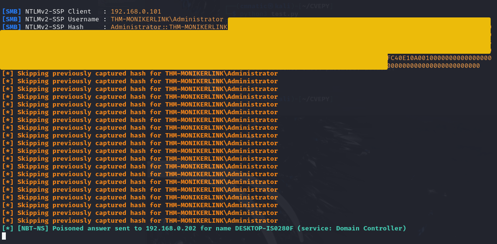
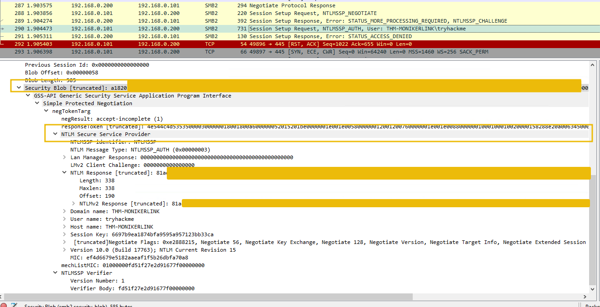

# CVE-2024-21413
This Python script is used to abuse the [CVE-2024-21413](https://msrc.microsoft.com/update-guide/en-US/advisory/CVE-2024-21413) coined "MonikerLink"

## Assumptions
This PoC has been created for a lab environment which means the server needs to be configured in a specific setting (i.e. TLS authentication is not supported for convenience). The actual vulnerability is very real, however, this is provided as a training ground. As this is for a specific lab environment, where the code is kept as basic as possible for a specific audience, I will not be adding features to this. If you are looking for a "more developed" PoC, I recommend checking out [Xaitax's](https://github.com/xaitax/CVE-2024-21413-Microsoft-Outlook-Remote-Code-Execution-Vulnerability).

## PRs / Contributions
Due to the above, I will most likely not be accepting PRs. Please feel free to fork and work on your fork, or create a new repo :)

## Victim
The victim runs a [hMailserver](https://www.hmailserver.com/) with the following inboxes:
- attacker@monikerlink.thm
- victim@monikerlink.thm

The password for the mailboxes are the same as the username i.e. `attacker:attacker`.

## Attacker
1. You will need to edit your hosts file to have the machine in your hosts file
	- `IPADDRESS monikerlink.thm`

2. You need to setup a responder on the interface
	- `responder -I eth0`

Alternatively, you can start an impacket server:
- `impacket-smbserver -smb2support -ip 0.0.0.0 test /tmp`

## Lab
I have uploaded the machine that runs the mail sever and Outlook client as an OVA. I will not guarantee its availability as I soon expect to have a room on TryHackMe for this. You can download it [here](http://cmnatic.helios.feralhosting.com/ovas/). You will most likely need to re-arm Office. You will have to google the instructions:)

If you use this, please just attribute that you sourced it from this repo, or, see the "Attribution" heading at the end of this README.

Additionally, I will not be offering support for this. If you want to try this online, please see my [room on TryHackMe](https://tryhackme.com/room/monikerlink)

> CVE-2024-21413  
> SHA256          01458DF6AC15F647BD901C0B39638CE9040E982DA2EE71737F330F392D7E867D

### Credentials:
tryhackme : Kkh3gv439dnq!  
administrator : D4nnyphant0m!

## Detection
### Yara
A [Yara rule](https://github.com/Neo23x0/signature-base/blob/master/yara/expl_outlook_cve_2024_21413.yar) has been created by [Florian Roth](https://twitter.com/cyb3rops) to detect emails containing the `file:\\` element.

## Wireshark

## Remediation
Microsoft has [released updates](https://msrc.microsoft.com/update-guide/vulnerability/CVE-2024-21413) for Microsoft Office.

## Attribution
If you download and use the lab/OVA attached to this OVA please just attribute [me (CMNatic)](https://github.com/CMNatic) and this repository (https://github.com/CMNatic/CVE-2024-21413). Feel free to use the lab as you please (i.e. courses, education, training, practice, etc) but remember that I do not guarantee its availability, nor will I offer any support.

If you are using the exploit/PoC, you must adhere to the "Disclaimer" below. Please don't be silly...only run this on systems that you own or have explicit permission (in writing) to test. 

# Disclaimer
This repo is intended for educational and ethical testing purposes only. Unauthorized scanning, testing, or exploiting of systems is illegal and unethical. Ensure you have explicit, authorized permission to engage in any testing or exploitation activities against target systems.
